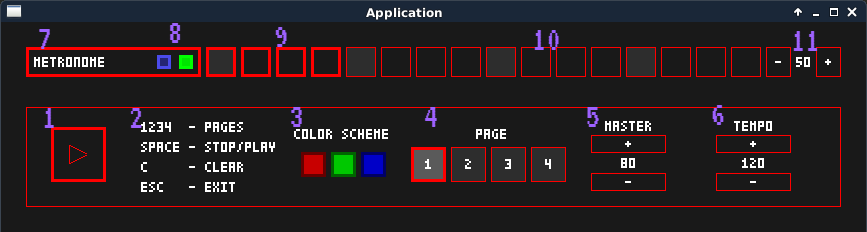

# Drum machine

Basic drum machine written in C++ using  library.

## Compile and build

### Prepare:
Add to *__iimavlib-master/examples/__*__CMakeLists.txt__ file inside _IF (BUILD_EXAMPLES) IF(SDL_FOUND)_ block:

```
add_executable(app app.cpp)
target_link_libraries ( app  ${EX_LIBS} )
install(TARGETS app RUNTIME DESTINATION bin)
```

### Configure:

```
./prepare_linux.sh
```

### Make

```
cd build
make
```

### Binaries

```
./bin/app
```

## How to use

These instructions will show you how to start and use this program.

### Synopsis

Device id has to be specified as first argument. If you want to use default device, use "DEFAULT" keyword.

_./app <device id|DEFAULT> [wav files or directories]_

### Examples

```
Launch with default device and without any wav file:
./app DEFAULT
```

```
Launch with device having id = "hw:0,0" and with two wav files:
./app "hw:0,0" ./wav/kick.wav ./wav/snare.wav
```

```
Launch with default device and with directory, containing several wav files:
./app DEFAULT ./wav
```

### GUI



#### Control panel

1) Stop / Play button
2) Hotkeys
3) Colore schemes
4) Paginator
5) Master volume controller
6) Tempo controller

#### Grid layout (sequence editor)

7) Track name
8) Blue button - reverse playback, green button - toggle mute
9) Active grid cells
10) Inactive grid cells
11) Per track volume controller
